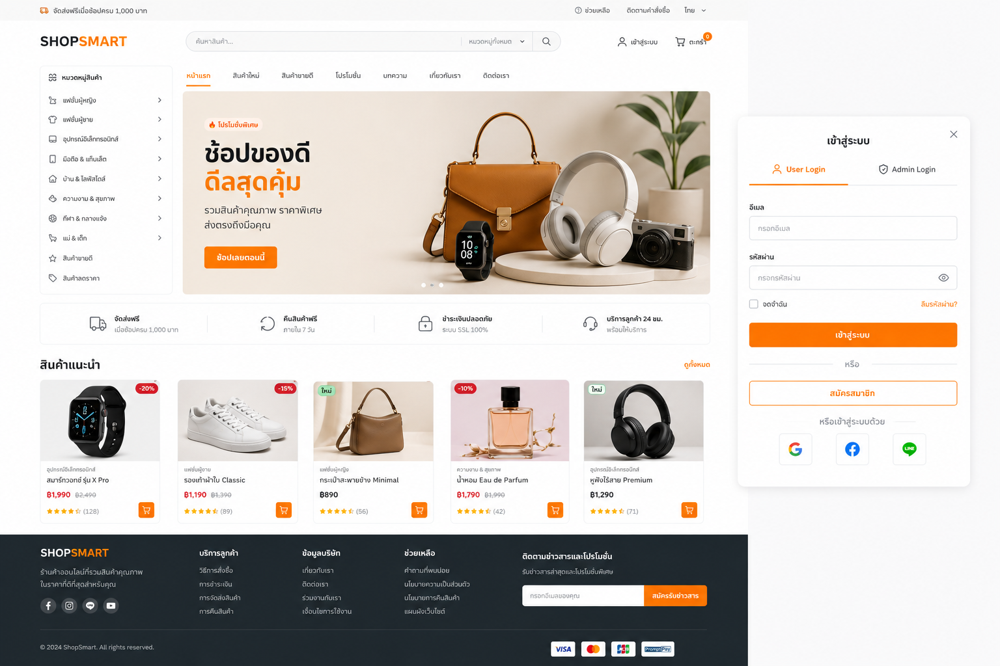

# ShopSmart 🛒

เว็บแอปพลิเคชัน **อีคอมเมิร์ซ (e-commerce)** ที่พัฒนาขึ้นแบบ production-ready — สถาปัตยกรรมโค้ดที่เป็นระเบียบ, UI ที่ทันสมัย, และพร้อมนำไป deploy ใช้งานจริง



## โปรเจกต์นี้คืออะไร ทำไมถึงสร้างขึ้นมา

ShopSmart เป็นโปรเจกต์ **พอร์ตโฟลิโอ (portfolio)** ที่จำลองการสร้างระบบร้านค้าออนไลน์แบบครบวงจร ตั้งใจสร้างขึ้นเพื่อแสดงให้เห็นว่าสามารถออกแบบและพัฒนาเว็บแอปพลิเคชันระดับที่ใช้งานจริง (production-grade) ได้ตั้งแต่ต้นจนจบ ไม่ใช่แค่ตัวอย่างโค้ดสั้นๆ โดยครอบคลุมทุกด้านที่ระบบอีคอมเมิร์ซจริงต้องมี:

- **ฝั่งลูกค้า (Storefront):** เรียกดูสินค้า ค้นหา กรอง ใส่ตะกร้า สั่งซื้อ ติดตามคำสั่งซื้อ
- **ฝั่งผู้ดูแลระบบ (Admin):** จัดการสินค้า หมวดหมู่ คำสั่งซื้อ คูปอง แบนเนอร์ ลูกค้า รีวิว และตั้งค่าเว็บไซต์
- **ระบบสิทธิ์การใช้งานหลายระดับ**, ความปลอดภัยตามมาตรฐาน (CSP, HSTS, rate limiting), ประสิทธิภาพการโหลดหน้าเว็บ, การรองรับสองภาษา (ไทย/อังกฤษ), การทดสอบอัตโนมัติ, ไปจนถึงการเตรียมพร้อม deploy ขึ้นเซิร์ฟเวอร์จริงด้วย Docker

พูดง่ายๆ คือทำขึ้นมาเพื่อพิสูจน์ทักษะการเขียนโปรแกรมแบบ full-stack ทั้งหมดในโปรเจกต์เดียว ตั้งแต่การออกแบบฐานข้อมูล ไปจนถึงหน้าตาที่ผู้ใช้เห็นจริง และระบบหลังบ้านที่เจ้าของร้านใช้บริหารจัดการ

## เทคโนโลยีที่ใช้

| ส่วนประกอบ | เทคโนโลยี |
|---|---|
| Backend | Laravel 12 · PHP 8.4 |
| ฐานข้อมูล | PostgreSQL ผ่าน Supabase (โฮสต์บนคลาวด์) |
| Frontend | Blade Template · Tailwind CSS · Alpine.js (เขียน component เองทั้งหมด ไม่ใช้ UI kit สำเร็จรูป) |
| ระบบยืนยันตัวตน | Laravel Breeze — auth เดียว แบ่งสิทธิ์ 4 ระดับ (Owner/Admin/Staff → `/admin`, User → หน้าร้านค้า) |
| Build Tool | Vite |
| Queue / Cache | Queue ใช้ฐานข้อมูล, Session/Cache ใช้ไฟล์ (ดูเหตุผลในหัวข้อ [หมายเหตุสำหรับรันบนเครื่อง local](#หมายเหตุสำหรับรันบนเครื่อง-local)) |
| กราฟ / ไอคอน | Chart.js · Heroicons |
| ความปลอดภัย | Content-Security-Policy พร้อม nonce ต่อ request, HSTS และ header ความปลอดภัยครบตามเกณฑ์ A+ ของ securityheaders.com |
| Container | `Dockerfile` สำหรับ production (Apache) + `compose.yaml` (Laravel Sail) สำหรับพัฒนาบนเครื่อง local |
| คุณภาพโค้ด | PHPUnit (ผ่าน 94 เคส) · PHPStan level 6 · Laravel Pint (มาตรฐาน PSR-12) |

## ฟีเจอร์หลัก

- 🏪 **หน้าร้านค้า:** หน้าแรก, หน้าสินค้าทั้งหมดพร้อมค้นหา/กรอง/เรียงลำดับ, หน้ารายละเอียดสินค้า (หลายรูป, ตัวเลือกสินค้า/variant), หมวดหมู่สินค้า
- 🛒 **ตะกร้าสินค้า** (รองรับทั้งผู้ใช้ที่ยังไม่ล็อกอินและล็อกอินแล้ว โดยจะรวมตะกร้าให้อัตโนมัติเมื่อล็อกอิน), รายการโปรด (wishlist), จำลองขั้นตอนชำระเงิน, ประวัติคำสั่งซื้อ
- 🧑‍💼 **ระบบหลังบ้าน (Admin):** แดชบอร์ดพร้อมกราฟวิเคราะห์ยอดขาย, จัดการสินค้า/หมวดหมู่/คำสั่งซื้อ/ลูกค้า/รีวิว/คูปอง/แบนเนอร์, ตั้งค่าเว็บไซต์ (โลโก้/favicon พร้อมพรีวิว, เปิด-ปิดการแสดงบัญชีทดลอง), บันทึกกิจกรรมผู้ดูแลระบบ (activity log)
- 👑 **ระบบสิทธิ์ 4 ระดับ:** **Owner** (สิทธิ์เต็ม) → **Admin** (บริหารร้านค้า) → **Staff** (ดูแลสินค้า/คำสั่งซื้อ/รีวิวเท่านั้น) → **User** (ลูกค้าทั่วไป) — ดูรายละเอียดที่ `App\Enums\UserRole`
- 🌐 รองรับ**สองภาษาเต็มรูปแบบ** (ไทย/อังกฤษ) ทั้งเว็บไซต์ (`lang/en`, `lang/th`) พร้อมจดจำภาษาที่เลือกไว้ต่อผู้ใช้
- 🔐 **ความปลอดภัย:** CSP + HSTS + header ความปลอดภัยครบตามเกณฑ์ securityheaders.com, การกำหนดสิทธิ์ (policies), การจำกัดจำนวนครั้งการเรียก API (rate limiting), ป้องกัน CSRF/XSS/SQL Injection, ตรวจสอบข้อมูลนำเข้าทุกจุด
- ⚡ **ประสิทธิภาพ:** eager loading ป้องกันปัญหา N+1, แบ่งหน้า (pagination), ทำ index ฐานข้อมูล, โหลดรูปภาพแบบ lazy, ลดจำนวน query ที่ซ้ำซ้อนในทุกหน้า
- 🔎 **SEO:** meta tags, Open Graph, sitemap.xml, canonical URL, ข้อมูลโครงสร้าง Schema.org
- 🐳 **Docker:** อิมเมจสำหรับ production แบบ multi-stage (build ด้วย Vite แล้วรันบน PHP 8.4 + Apache พร้อม queue worker ควบคุมด้วย Supervisor) และไฟล์ compose สำหรับพัฒนาบนเครื่อง local ด้วย Laravel Sail

## เริ่มต้นใช้งาน

### สิ่งที่ต้องมีก่อน

- PHP 8.4 พร้อมส่วนเสริม `pdo_pgsql`, `intl`, `zip`, `gd`, `mbstring`
- Composer 2
- Node.js 20 ขึ้นไป
- โปรเจกต์ Supabase (ใช้แผนฟรีได้)

### ขั้นตอนติดตั้ง

```bash
git clone <repo-url> shopsmart && cd shopsmart
composer install
npm install

cp .env.example .env
php artisan key:generate
```

กรอกข้อมูลเชื่อมต่อ Supabase ใน `.env` (ดูได้จาก Supabase Dashboard → Project Settings → Database):

```dotenv
DB_CONNECTION=pgsql
DB_HOST=aws-0-<region>.pooler.supabase.com
DB_PORT=5432
DB_DATABASE=postgres
DB_USERNAME=postgres.<project-ref>
DB_PASSWORD=<รหัสผ่านของคุณ>
DB_SSLMODE=require
```

จากนั้นรัน:

```bash
php artisan migrate --seed
php artisan storage:link
composer run dev   # รันเว็บ + queue worker + log + vite พร้อมกัน
```

### บัญชีทดลองใช้งาน

ทุกบัญชีใช้รหัสผ่าน `password` เหมือนกัน และสามารถเปิด/ปิดการแสดงกล่องข้อความบัญชีทดลองในหน้า login ได้จาก **Admin → ตั้งค่าเว็บไซต์**

| สิทธิ์ | อีเมล | สามารถทำอะไรได้บ้าง |
|---|---|---|
| Owner | admin@example.com | เข้าถึงระบบหลังบ้านได้ทั้งหมด รวมถึงจัดการผู้ใช้/สิทธิ์และตั้งค่าระบบ |
| Admin | manager@example.com | บริหารร้านค้า (สินค้า, คำสั่งซื้อ, รีวิว, หมวดหมู่, คูปอง, แบนเนอร์, ลูกค้า, log) |
| Staff | staff@example.com | ดูแลเฉพาะสินค้า/คำสั่งซื้อ/รีวิวเท่านั้น |
| User | user@example.com | ลูกค้าทั่วไปที่ใช้งานหน้าร้านค้า |

### เครื่องมือตรวจสอบคุณภาพโค้ด

```bash
composer test      # รันชุดทดสอบ PHPUnit (ใช้ SQLite in-memory แยกจากฐานข้อมูลจริง)
composer analyse   # ตรวจสอบ static analysis ด้วย PHPStan level 6 (Larastan)
composer format    # จัดรูปแบบโค้ดตามมาตรฐาน PSR-12 ด้วย Laravel Pint
composer quality   # รันทั้งสามอย่างข้างต้นเรียงกัน
```

### Docker

มีไฟล์ Docker อยู่ 2 ชุด แยกจุดประสงค์กันชัดเจน:

| ไฟล์ | ใช้ทำอะไร |
|---|---|
| `Dockerfile` + `.dockerignore` + โฟลเดอร์ `docker/` | อิมเมจสำหรับ **production**: build แบบ multi-stage (Node/Vite → `php:8.4-apache`), ใช้ Supervisor รัน Apache คู่กับ queue worker, entrypoint จัดการเรื่อง `$PORT` (สำหรับ Railway/Render) และ warm cache ให้อัตโนมัติ ดูรายละเอียดที่ [docs/DEPLOYMENT.md](docs/DEPLOYMENT.md#docker) |
| `compose.yaml` | สำหรับ **พัฒนาบนเครื่อง local เท่านั้น** ผ่าน Laravel Sail ไม่ได้ใช้สำหรับ production |

ทดสอบ build และรันอิมเมจ production บนเครื่องตัวเอง:

```bash
docker build -t shopsmart:test .
docker run -d -p 8080:80 --env-file .env shopsmart:test
curl -I http://127.0.0.1:8080/
```

## หมายเหตุสำหรับรันบนเครื่อง local

- **Session/Cache ใช้ driver แบบไฟล์ ไม่ใช่ฐานข้อมูล** เหตุผลคือย้ายออกจากฐานข้อมูล Supabase ที่อยู่ไกล เพื่อแก้ปัญหาโหลดหน้าเว็บช้า (เพราะทุกครั้งที่อ่าน/เขียน session ต้องวิ่งไปเซิร์ฟเวอร์ต่างภูมิภาค) ส่วน queue ยังใช้ฐานข้อมูลเหมือนเดิมเพราะ job มีไม่บ่อยเท่า request ปกติ
- **`php artisan serve` บน Windows จะรันได้แค่ 1 worker เท่านั้น** ถึงแม้ `.env` จะตั้งค่า `PHP_CLI_SERVER_WORKERS=4` ไว้ แต่ฟีเจอร์นี้ของ PHP built-in server ใช้ `pcntl_fork()` ซึ่งไม่มีบน Windows ทำให้ค่านี้ไม่มีผลใดๆ บนเครื่อง Windows หน้าเว็บที่มีการโหลดรูปภาพพร้อมกันหลายรูปอาจทำให้ dev server (ซึ่งรันแบบ single-thread) รับมือไม่ไหวและตอบกลับด้วย `503` เป็นครั้งคราว — เป็นข้อจำกัดเฉพาะตอนพัฒนาเท่านั้น (อิมเมจ Docker ใช้ Apache ซึ่งไม่มีปัญหานี้)
- **ควรเข้าเว็บผ่าน host เดียวกับที่ตั้งไว้ใน `APP_URL`** (ค่าเริ่มต้นคือ `http://localhost:8000`) อย่าสลับใช้ `localhost` กับ `127.0.0.1` ปนกัน เพราะ URL ของไฟล์ที่อัปโหลด (`Storage::disk('public')->url()`) ถูกออกแบบให้เป็น root-relative path โดยตั้งใจเพื่อหลีกเลี่ยงปัญหานี้ (ดูที่ `config/filesystems.php`) แต่บางจุด (เช่น Open Graph meta tag, Schema.org `image`) ยังจำเป็นต้องใช้ URL แบบเต็มซึ่งอ้างอิงจาก request ปัจจุบันผ่านฟังก์ชัน `url()` — จุดนี้ก็จะผิดพลาดเช่นกันถ้า host ที่เข้าใช้งานไม่ตรงกับที่ request เห็น

## เอกสารเพิ่มเติม สำหรับต่อยอดพัฒนา

โปรเจกต์นี้มีเอกสารแยกไว้ให้อ่านต่อ ขึ้นอยู่กับว่าต้องการทำความเข้าใจเรื่องไหน:

- [docs/ARCHITECTURE.md](docs/ARCHITECTURE.md) — โครงสร้างสถาปัตยกรรม, layer ต่างๆ, แนวทางการเขียนโค้ด, และเส้นทางการทำงานของ request
- [docs/DATABASE.md](docs/DATABASE.md) — แผนภาพ ER และรายละเอียดตารางในฐานข้อมูล
- [docs/DEPLOYMENT.md](docs/DEPLOYMENT.md) — คู่มือ deploy ขึ้น Railway, Render, Docker และ VPS พร้อม checklist ก่อนขึ้น production
- [skill.md](skill.md) — เอกสารสรุปสำหรับ AI assistant (เช่น Claude) ที่จะมาช่วยพัฒนาต่อ รวบรวมข้อควรระวังและบั๊กที่เคยเจอมาแล้วในโปรเจกต์นี้ ไว้ไม่ให้ต้องเจอซ้ำ

หากต้องการนำโปรเจกต์นี้ไปต่อยอด แนะนำให้เริ่มอ่านจาก `docs/ARCHITECTURE.md` ก่อน เพื่อเข้าใจภาพรวมของโครงสร้างโค้ด จากนั้นค่อยดู `skill.md` เพื่อรู้ว่ามีจุดไหนที่ต้องระวังเป็นพิเศษ

## ลำดับขั้นการพัฒนา

โปรเจกต์นี้พัฒนาเป็นเฟสตามลำดับ ตั้งแต่วางโครงสร้างไปจนถึง deploy จริง:

| เฟส | ขอบเขตงาน | สถานะ |
|---|---|---|
| 1 | วางโครงสร้างโปรเจกต์และสถาปัตยกรรม | ✅ |
| 2 | ระบบยืนยันตัวตนและจัดการสิทธิ์ | ✅ |
| 3 | ออกแบบฐานข้อมูลและ Model | ✅ |
| 4 | หน้าตาผู้ใช้งาน (UI) | ✅ |
| 5 | แดชบอร์ดผู้ดูแลระบบ | ✅ |
| 6 | จัดการสินค้า | ✅ |
| 7 | ตะกร้า, รายการโปรด และคำสั่งซื้อ | ✅ |
| 8 | ประสิทธิภาพและความปลอดภัย | ✅ |
| 9 | ทดสอบระบบและตรวจสอบโค้ด | ✅ |
| 10 | เตรียม deploy และจัดทำเอกสาร | ✅ |
| — | ปรับปรุงหลังเปิดใช้งาน: ระบบสิทธิ์ 4 ระดับ, รองรับสองภาษาเต็มรูปแบบ, ปรับ UI ให้ใช้งานง่ายบนมือถือ, ย้าย session/cache ออกจากฐานข้อมูลหลัก, เพิ่ม security header (CSP/HSTS), เพิ่ม Docker (production + Sail) | ✅ |
